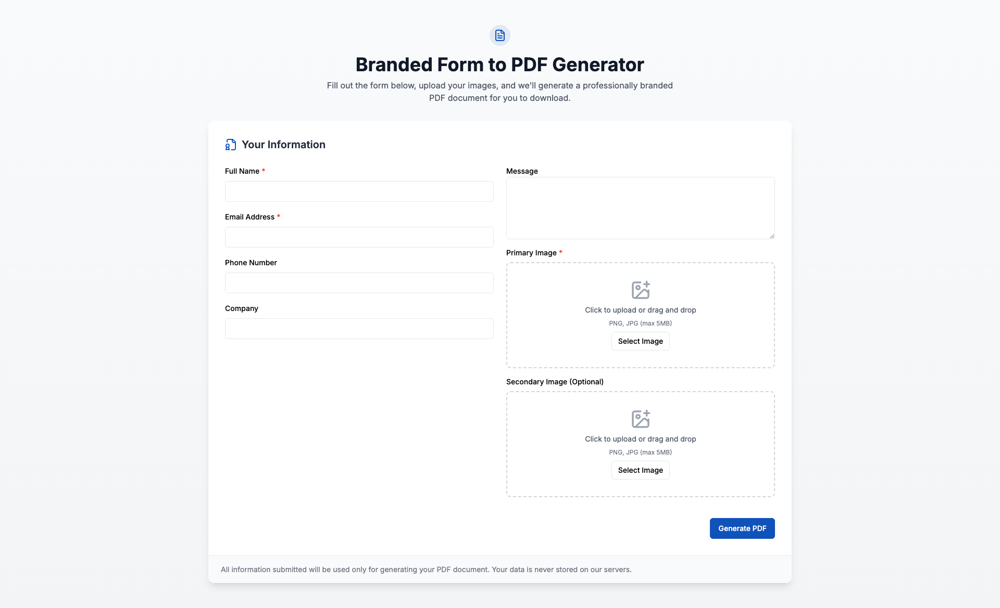

# Branded Form to PDF Generator


*Screenshot: The user-facing form for input and image upload.*

[View a sample generated PDF &rarr;](./readme/demo-generated.pdf)
*Example: The PDF invoice generated by this tool, using the uploaded image as the logo.*

A lightweight, web-based tool that allows users to fill out a form, upload an image, and generate a professionally branded PDF invoice for direct download.

## Features
- Responsive web form for user input
- Image upload (used as the logo in the PDF)
- Generates a modern, branded invoice-style PDF
- Immediate PDF download after form submission
- All other invoice fields are currently filled with mock data

## Tech Stack
- **Frontend:** React, TypeScript, Vite
- **PDF Generation:** [@react-pdf/renderer](https://react-pdf.org/)
- **Styling:** Tailwind CSS
- **Form Handling:** react-hook-form

## Setup
1. **Install dependencies:**
   ```bash
   npm install
   ```
2. **Run the development server:**
   ```bash
   npm run dev
   ```
3. **Open your browser:**
   Visit [http://localhost:5173](http://localhost:5173) (or the port shown in your terminal).

## Usage
1. Fill out the form fields.
2. Upload an image (this will be used as the logo in the PDF invoice).
3. Click "Generate PDF".
4. The PDF will be generated and downloaded automatically.

## Customization
- The PDF template is styled to match a modern invoice (see `/src/services/pdfGenerator.tsx`).
- Only the uploaded image is used from the form; all other fields are currently mock data.
- To map real form data to the invoice, update the PDF generation logic in `pdfGenerator.tsx`.

## License
MIT
